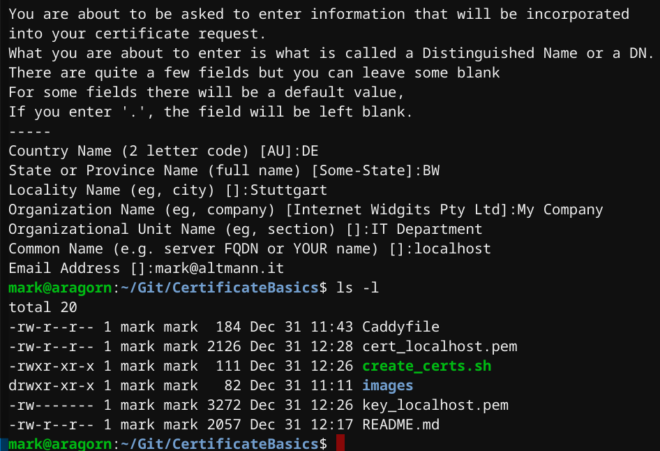
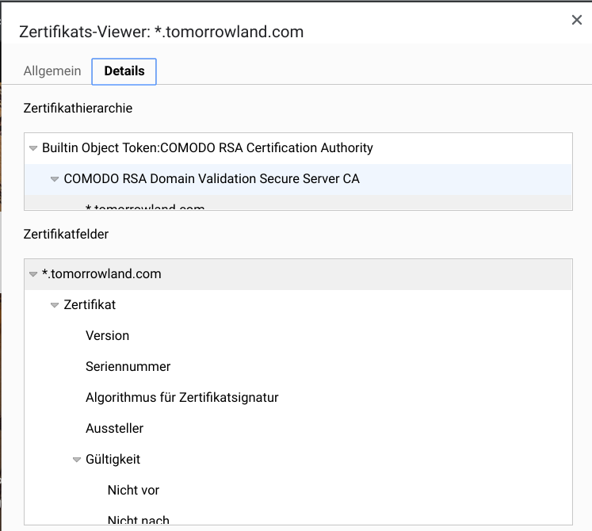

# Certificate Basics

Today we look at certificate Basics, how trust generally works, and specific details when working with Windows vs. Linux.


## Prerequisites

We need [Caddy](https://github.com/caddyserver/caddy/releases) and [OpenSSL](https://github.com/openssl/openssl/releases) installed on your system for the setup script.
If you use the Bosch Git, you already have a basic bash, and the script should work on your Windows OS. 

> OpenSSL can also be installed through the Anaconda3 package (python environment) via Bosch SCCM.   
More information on Caddy can be found here: <https://caddyserver.com/docs/>.

```bash
~$ caddy version
v2.0.0-beta11 h1:NVHnPAdZPt6OUBMltUMe2DWVsyYRbeE6NxhCm3AjGT8=

~$ openssl version
OpenSSL 1.1.0l  10 Sep 2019
```


## Setup

OpenSSL is used to create certificates and Caddy to have a versatile WebServer running on localhost.
Caddy is now using a JSON format that you should adopt from the provided caddy.json:

If you have installed the tools, run `create_certs.sh` to create your certs.  


Now you can start the Caddy Server with the local TLS config (Details in the caddy.json)

```bash
# To start Caddy:
~$ caddy start --config caddy.json

# To stop Caddy:
~$ caddy stop
```

If the start was successful, you should see something like this:

```bash
~/Git/CertificateBasics$ caddy start --config caddy.json  
2020/01/07 22:53:05.468 INFO    admin   admin endpoint started  {"address": "localhost:2019", "enforce_origin": false, "origins": ["localhost:2019"]}
2020/01/07 23:53:05 [INFO][cache:0xc000265540] Started certificate maintenance routine
2020/01/07 23:53:05 [WARNING] Stapling OCSP: no OCSP stapling for [localhost]: no OCSP server specified in certificate
2020/01/07 22:53:05.480 INFO    tls     cleaned up storage units
2020/01/07 22:53:05.481 INFO    admin   Caddy 2 serving initial configuration
Successfully started Caddy (pid=12056)
```


## Test Cases

Now try to see whether a standard curl request does, what it should do.

First, let's try the insecure request:
```bash
~$ curl https://localhost:2020 --insecure
Hello world!
```

Secondly, let's try the secure method:
```bash
~$ curl https://localhost:2020
2020/01/08 00:01:51 http: TLS handshake error from [::1]:40426: remote error: tls: unknown certificate authority
curl: (60) SSL certificate problem: self signed certificate
More details here: https://curl.haxx.se/docs/sslcerts.html

curl performs SSL certificate verification by default, using a "bundle" of Certificate Authority (CA) public keys (CA certs). If the default bundle file isn't adequate, you can specify an alternate file using the --cacert option.
If this HTTPS server uses a certificate signed by a CA represented in the bundle, the certificate verification probably failed due to a problem with the certificate (it might be expired, or the name might not match the domain name in the URL).
If you'd like to turn off curl's verification of the certificate, use the -k (or --insecure) option.
```

So as we can see, `curl` told us there is a certificate problem and precisely even a self-signed one...  
It seems that, for some odd reason, my system does not trust this self signed certificate...

And for a good reason. If a malicious party puts itself in between my browser and the web server, they can practically decrypt all the traffic.  
Hence every system that can speak http/tls has provided CA certs in a bundle file. Some browsers like Firefox bring their own, Chrome and IE use the one of the system. Java is os-independent and uses its own keystore. The very same is true for python, which uses the "certifi" package.

Lastly, let's try the correct and secure method:
```bash
mark@aragorn:~$ curl https://localhost:2020 --cacert cert_localhost.pem  
Hello world!
```

> **Note**:   
We can also add the cert to the ca path in my os or the key store of your programming language. Some information about those:

- Linux Standard: "/etc/ssl/certs/ca-certificates.crt"
- 
- 
- ?redirectedfrom=MSDN)
- 
- 
- IE uses the Windows Certificate Store

## Certificate Handling

Certificates are all about trust.   
This trust is achieved through cryptography and the private/public key approach.

This means that for each public certificate, there is a corresponding private key to use. The key is used to decrypt packets that have been encrypted with the public certificate.

Furthermore, each certificate usually exists in a chain. For publicly available sites/endpoints, this starts with a CA (certificate authority) and a subsequent IA (Intermediate authority).  
The main difference is the timeframe of validity and the airgapness of the root certificate versus the intermediate certificate.  
The reason is that under no circumstances, a 3rd party can gain access to the root CA.
The intermediate CA is used on connected servers to run the service in an automated fashion. In addition to that, IAs can be quickly replaced if they have been compromised.  
Without them, each cert signing would need a manual effort and copy/paste actions (god forbid...)

This can be observed in your browser settings:





## Enterprise Environments

In internal enterprise environments, this is somewhat the same. The difference here is that you do not have to rely on the "trusted" 3rd parties of the browser OEMs, but on your enterprise PKI (Public Key Infrastructure).  
This PKI is used to create your root and subordinate CAs and can create your needed certificates.  
Indeed, many cloud providers, like Azure or AWS, do have PKI services backed by HSMs (Hardware Security Module) to achieve the very same in cloud environments.

Thx!
